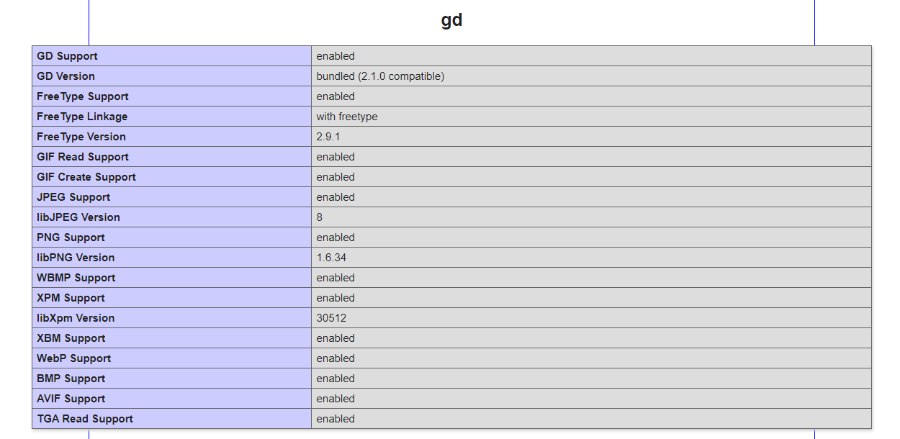

# Театр не театра

### notheatre.org

Сайт-визитка, сделанный на базе MVC-фреймворка без использования других фреймворков.

Оформлены общая шапка и подвал сайта для всех страниц

Сайт имеет 4 страницы:
* ближайший спектакль;
* афиша;
* кассы;
* контакты

Перенаправление страниц сделано на основе использование переменной $_SERVER['REDIRECT_URL']: url имеют вид *notheatre.org/название страницы*.

### PHP GD

